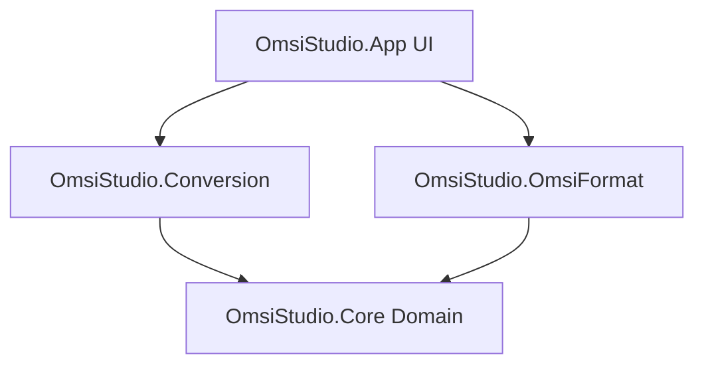

# OmsiStudio

OmsiStudio is a desktop tool built with **.NET 8** and **Avalonia UI** designed to browse, scan, analyze, and manage OMSI scenery object assets, with a structured pathway toward future 3D asset conversion.

---

## 🚀 Getting Started (Developer Runbook)

### Prerequisites
*   [.NET 8 SDK](https://dotnet.microsoft.com/download/dotnet/8.0)

### Essential Commands
Use the following commands from the repository root directory to build, test, and run the application:

*   **Build the Solution**:
    ```bash
    dotnet build OmsiStudio.sln --no-restore
    ```
*   **Run Unit Tests**:
    ```bash
    dotnet test OmsiStudio.sln --no-restore --no-build
    ```
*   **Run the GUI Application**:
    ```bash
    dotnet run --project OmsiStudio.App/OmsiStudio.App.csproj
    ```

---

## 🏛️ Project Architecture

The solution is divided into clean, decoupled layers to maintain strict separation of concerns and avoid dependency cycle pollution:



### 1. Production Projects
*   [OmsiStudio.Core](OmsiStudio.Core/)
    *   Defines core domain entities (`OmsiAsset`, `OmsiModelReference`, etc.), contracts, and interfaces.
    *   No external dependencies on specific parsing libraries or UI frameworks.
*   [OmsiStudio.OmsiFormat](OmsiStudio.OmsiFormat/)
    *   Contains the parser and scanner logic for reading OMSI Scenery Object (`.sco`) file formats, parsing tags recursively (handling Turkish/English localization and multi-encoding files), and resolving model mesh file paths dynamically.
*   [OmsiStudio.Conversion](OmsiStudio.Conversion/)
    *   Orchestrates export and conversion processes, including serialization of export manifests into JSON formats.
*   [OmsiStudio.App](OmsiStudio.App/)
    *   The desktop UI built with Avalonia UI. It handles the browser view, search/filtering, dynamic localization (TR/EN), and last scanned path persistence.

### 2. Test Projects (Split by Architecture Layer)
Each layer has a corresponding isolated test project to enforce clean dependency mapping and clean-up execution:
*   `OmsiStudio.Core.Tests`: Core domain/preview model contract tests.
*   `OmsiStudio.OmsiFormat.Tests`: Mappings, fixture-based parsing, and path resolution tests.
*   `OmsiStudio.Conversion.Tests`: Manifest serialization validation, and conversion contract tests (utilizing unique, test-isolated temp paths with automated teardown/cleanup).
*   `OmsiStudio.App.Tests`: ViewModel behavior, localization properties, folder pick routing, and data binding change notification tests.

---

## 🎯 Current Implemented Scope

*   **OMSI Asset Scanning & Parsing**: Recursively scans user-selected OMSI root directory path, parses `.sco` files, extracts descriptive text, sound references, collision properties, and texture maps.
*   **Encodings**: Gracefully handles Turkish ANSI, windows-1254, and windows-1252 to render characters correctly.
*   **Model Reference Path Resolution**: Traces mesh name references, mapping them to actual file locations in model folders and marking them resolved/unresolved.
*   **O3D Metadata Pipeline**: Safely reads `.o3d` files to parse version, encrypted status, header-level counts (meshes, vertices, triangles, materials), and texture references. Displays this metadata details and diagnostics in the UI asset details panel.
*   **O3D Geometry Pipeline**: Safely parses supported, unencrypted `.o3d` geometry files into internal mesh data (vertices, normals, UVs, triangle indices, and material slot references), with complete DoS count verification, bounds checks (for vertex and material slot indices), and string length safety constraints.
*   **Dynamic Localization**: The UI language is Turkish by default, switchable dynamically to English in runtime.
*   **Persistent Settings**: Stores the last successfully scanned root path and active language to a local JSON settings file.
*   **Manifest-Only Export**: Allows users to select an asset and write a deterministic `[sco_filename]_manifest.json` file summarizing asset metadata to their chosen target output directory.
*   **3D Viewport Preview**: Displays software-rendered solid/wireframe previews of supported O3D files with orbit/zoom camera controls, bounding box overlay, material slot color swatches, and size summary. Includes performance guardrails to skip rendering huge models. (Note: OpenGL preview remains experimental).

---

## 🎯 Intentionally Not Implemented (Future Scope)

> [!WARNING]
> The following features **DO NOT** exist in the codebase yet and are reserved for future development spikes:
> *   **No 3D Model Conversion/Export**: Formats like glTF, OBJ, or FBX conversion and geometry mesh creation are currently unsupported placeholder targets.
> *   **No Real Texture Mapping**: Displaying actual texture bitmap images mapped on the faces via UV coordinates is out of scope. We utilize a texture-aware deterministic solid flat color preview.

For format research details on the binary `.o3d` structures, see the spike research document: [O3D_FORMAT_RESEARCH.md](docs/spikes/O3D_FORMAT_RESEARCH.md).

---

## 🛣️ Product Direction

For the long-term vision, architectural modules, and technical scope of OmsiStudio, see the [Product Roadmap](docs/PRODUCT_ROADMAP.md).

---

## 📖 Key Project Documentation

*   [PRODUCT_ROADMAP.md](docs/PRODUCT_ROADMAP.md): OmsiStudio long-term vision, modular structures, and milestones.
*   [OMSISTUDIO_EPIC_BACKLOG.md](docs/backlog/OMSISTUDIO_EPIC_BACKLOG.md): Epic roadmap and tracking backlog.
*   [ASSET_PREVIEW_SYSTEM_EPIC.md](docs/backlog/ASSET_PREVIEW_SYSTEM_EPIC.md): Completed software-rendered solid/wireframe asset preview epic.
*   [REALISTIC_ASSET_PREVIEW_EPIC.md](docs/backlog/REALISTIC_ASSET_PREVIEW_EPIC.md): Planned epic for realistic, texture-mapped multi-mesh asset previews (future scope).
*   [DOMAIN_MODEL.md](docs/domain/DOMAIN_MODEL.md): Deep-dive into domain entities and constraints.
*   [O3D_FORMAT_RESEARCH.md](docs/spikes/O3D_FORMAT_RESEARCH.md): Research spike documentation regarding future binary mesh format supports.
*   [AI_Governance Docs Folder](docs/AI_Governance/): Repository discovery rules, SDLC, templates, and agent guidelines.
