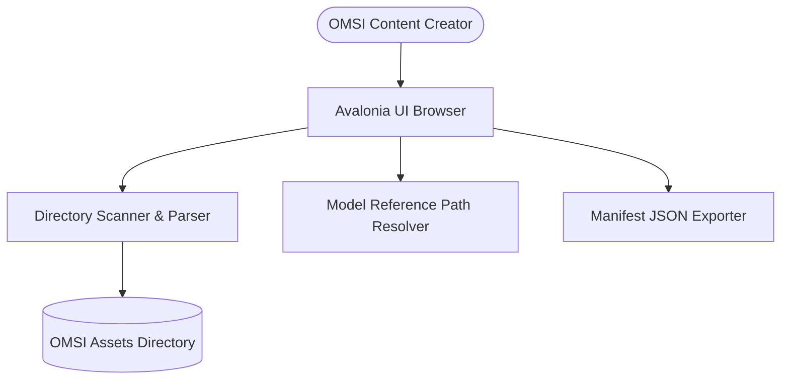

# OmsiStudio: Project Delivery & Implementation Summary

This document provides a high-level overview of the completed features, architecture, and current state of **OmsiStudio** to facilitate alignment with the Product Manager.

---

## 📋 Executive Summary
OmsiStudio has successfully achieved its first functional milestone (Vertical Slice). The codebase is fully buildable, tested, and localized, offering a complete scenery object scanner and asset browser desktop GUI alongside prototype manifest-only conversion capabilities.

---

## 🛠️ Completed Features & Capabilities

### 1. Scenery Object Browser & Directory Scanner
*   **Recursive Directory Scanning**: Recursively scans directories to discover OMSI scenery objects (`.sco`). SURFACES parsing errors or formatting warnings dynamically back to the UI.
*   **Encoding & Turkish Character Support**: Detects and decodes multiple encoding standards (Turkish ANSI, Windows-1254, Windows-1252) to render localization data correctly.
*   **Search & Filtering**: Multi-token search filters objects instantly matching by name, folder path, tags, description, or referenced textures.
*   **Group View Organization**: Organizes asset listings dynamically, letting users group items either by relative folder path or by their parsed category tags.

### 2. Deep `.sco` Parsing & Model Resolution
*   **Metadata Parser**: Extracts object attributes, sound triggers, scripts, collision properties, and texture maps.
*   **Path Reference Resolution**: Traces mesh file name references (`.o3d`) under object files and checks them against the physical folders on disk, identifying which dependencies are **Resolved** and which are **Missing**.

### 3. Desktop GUI & User Experience (UX)
*   **Dynamic Localization**: The interface defaults to Turkish, but users can change language to English in runtime without restarting.
*   **Setting Persistence**: Saves the last successfully scanned OMSI folder root and preferred UI language to local JSON configurations, auto-loading them on startup.
*   **Clean MVVM Bindings**: Clean Avalonia UI data-binding updates; status card visibility changes trigger immediately upon conversion success/failure.

### 4. Manifest Exporter Prototype
*   **Conversion Layer Contract**: Formalized conversion pipelines (`ConversionRequest`, `ConversionResult`, status codes).
*   **Deterministic JSON Manifests**: Creates and serializes asset details into a standardized manifest format, saving it as `[sco_filename]_manifest.json` in the user's selected export folder.

---

## 🏛️ Architecture & Code Hygiene

The solution is divided into decoupled layers to prevent dependency pollution:

| Layer | Project | Responsibility | Key Technologies |
| :--- | :--- | :--- | :--- |
| **UI Presentation** | [OmsiStudio.App](OmsiStudio.App/) | Views, ViewModels, setting pickers, localization resources. | Avalonia UI, CommunityToolkit.Mvvm |
| **Conversion Engine** | [OmsiStudio.Conversion](OmsiStudio.Conversion/) | JSON manifest assembly and writing logic. | .NET System.Text.Json |
| **Parser & Scanner** | [OmsiStudio.OmsiFormat](OmsiStudio.OmsiFormat/) | `.sco` file parsing, scanning, model path resolution. | System.IO, Encoding libraries |
| **Core Domain** | [OmsiStudio.Core](OmsiStudio.Core/) | Baseline contracts, domain entities (`OmsiAsset`). | Pure C# (.NET 8) |

### Test Suite Alignment
Each production project has a corresponding test project verifying requirements under separation:
*   `OmsiStudio.OmsiFormat.Tests` (Scanner/Parser correctness, fixtures, encoding decoders)
*   `OmsiStudio.App.Tests` (ViewModel actions, dynamic localization, binding PropertyChanged events)
*   `OmsiStudio.Conversion.Tests` (Manifest writing rules, unique temporary folder isolation and cleanups)

---

## 🛑 Scope Exclusions (What is Not Implemented Yet)
To keep the presentation aligned with true progress, here are features that are **intentionally not yet developed**:
*   **No Binary `.o3d` parsing**: Scans and locates referenced mesh files, but does not parse binary geometric data.
*   **No 3D viewport rendering**: The browser shows text metadata, references, and paths; it does not render 3D meshes or scenes.
*   **No 3D format export**: Conversion to glTF, OBJ, or FBX is not supported yet (manifest export is placeholder metadata only).

---

## 📈 Current Project Quality & Health
*   **Compile Status**: `Passed` (0 errors, 0 warnings).
*   **Unit Tests**: `Passed` (79 / 79 unit tests run and pass successfully).
*   **Teardown**: Automated test cleanup guarantees that no temporary test folder leftovers persist on disk.
*   **Runbook**: A clear, developer-friendly [README.md](README.md) exists at the solution root.
