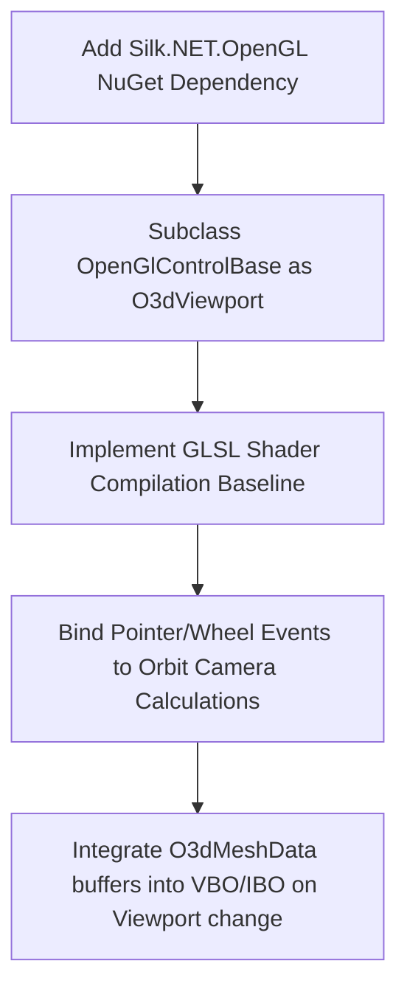

# OS-008-SPIKE-001 - Choose Avalonia 3D Rendering Approach

This spike document evaluates and selects the optimal technical approach for integrating a cross-platform 3D preview renderer into OmsiStudio (built with Avalonia UI and .NET 8). The renderer will visualize the unencrypted `.o3d` mesh geometry parsed during previous phases.

---

## 1. Candidate Options

We evaluated three main approaches for hosting and rendering 3D graphics inside Avalonia UI on macOS, Windows, and Linux.

### Option A: Avalonia Native `OpenGlControlBase` with Silk.NET Bindings (Recommended)
This approach leverages Avalonia's built-in `OpenGlControlBase` to handle OpenGL context creation and platform integration, combined with **Silk.NET** (modern, high-performance bindings maintained by the .NET Foundation) for OpenGL API calls.

*   **Mechanism**: Subclass `OpenGlControlBase` and override `OnOpenGlInit`, `OnOpenGlDeinit`, and `OnOpenGlRender`.
*   **Pros**:
    *   **Native Composition**: Renders directly inside Avalonia’s layout tree. No "airspace" problem (UI overlays like text or buttons can draw on top of the 3D viewport).
    *   **Platform Support**: Native EGL/GLX/WGL handle negotiation is managed by Avalonia on Windows, Linux, and macOS.
    *   **Performance**: Directly integrated into the compositor.
*   **Cons**:
    *   Restricted to OpenGL API (does not natively support Vulkan/Metal/Direct3D without extensions).
    *   Careful management of state sharing with Avalonia's compositor is required.

### Option B: Veldrid (Cross-Platform Graphics API Wrapper)
**Veldrid** is a low-level graphics library that wraps Vulkan, Metal, Direct3D 11, and OpenGL.

*   **Mechanism**: Render offscreen to a GPU texture using Veldrid, copy/interop the texture into an Avalonia `WriteableBitmap` or host via platform-native rendering windows.
*   **Pros**:
    *   **Modern APIs**: Can use Metal on macOS, Direct3D on Windows, and Vulkan on Linux.
    *   Avoids old OpenGL drivers on macOS.
*   **Cons**:
    *   **High Complexity**: Offscreen texture sharing/interop is extremely complex, error-prone, and slow.
    *   **Threading Hazards**: Thread synchronization between Avalonia's render loop and Veldrid is difficult.
    *   **Native Control Airspace**: Hosting Veldrid via `NativeControlHost` causes overlay issues (clipping and z-ordering bugs).

### Option C: OpenTK with `NativeControlHost`
**OpenTK** is a mature OpenGL framework.

*   **Mechanism**: Host a native Win32/X11/Cocoa window handle using Avalonia's `NativeControlHost` control, and initialize OpenTK within it.
*   **Pros**:
    *   Mature, well-understood library with extensive tutorials.
*   **Cons**:
    *   **Airspace Problem**: Native window hosting sits on top of all Avalonia elements. No Avalonia overlays can render on top of the viewport.
    *   **Resize Glitches**: Extreme lag and flickering when resizing the native control.
    *   **Heavy Platform Glue**: Requires writing platform-specific initialization code (Cocoa on macOS, HWND on Windows, X11 on Linux).

---

## 2. Technical Comparison

| Criteria | Option A (OpenGlControlBase + Silk.NET) | Option B (Veldrid) | Option C (OpenTK + NativeControlHost) |
| :--- | :--- | :--- | :--- |
| **macOS Compatibility** | ✅ Yes (Legacy OpenGL 4.1 Core Profile via Avalonia) | ✅ Yes (Metal/OpenGL) | ⚠️ Complex Cocoa Window Integration |
| **Windows Compatibility** | ✅ Yes (Native OpenGL or ANGLE/Direct3D fallback) | ✅ Yes (Direct3D 11/Vulkan/OpenGL) | ✅ Yes (Native Win32 GL Control) |
| **Linux Compatibility** | ✅ Yes (Native EGL/GLX via Avalonia) | ✅ Yes (Vulkan/OpenGL) | ⚠️ Complex X11 Window Integration |
| **Airspace Issues** | None (Fully composed) | High (If hosted natively) / None (If texture-mapped) | Critical (Always sits on top) |
| **Resize Performance** | Fluid (Sub-pixel composition) | Laggy (Texture allocation overhead) | Poor (Flickers during native window resize) |
| **Context Lifecycle** | Managed by Avalonia | Manual | Manual / Platform-specific |
| **Input Handling** | Native Avalonia pointer events | Platform-specific / Custom bridge | Platform-specific / Custom bridge |
| **MVVM Compatibility** | High (Custom control properties bound to VM) | Medium | Low |

---

## 3. GPU Context & Architecture Risks

### 1. GPU Context Lifecycle & Threading
*   **Risk**: Avalonia renders using a background render thread (compositor). Performing OpenGL operations on the UI thread while the context is active on the render thread causes access violations.
*   **Mitigation**: Always perform OpenGL rendering operations within the overridden lifecycle callbacks (`OnOpenGlRender`, etc.) provided by `OpenGlControlBase`, which are guaranteed to execute on the correct thread with the context made current.

### 2. Platform OpenGL Profile Mismatches
*   **Risk**: macOS restricts OpenGL to Core Profile 4.1. Modern compute shaders and extensions (OpenGL 4.3+) are unavailable.
*   **Mitigation**: Design the shaders and buffer structures to remain compatible with **OpenGL 3.3 / OpenGL ES 2.0**. This baseline works perfectly on all target desktop platforms and mobile/embedded variants.

### 3. Resource Disposal (Memory Leaks)
*   **Risk**: Native GPU allocations (Vertex Buffer Objects, Index Buffer Objects, Vertex Array Objects, and Textures) are not managed by the .NET Garbage Collector. Unloading the UI without freeing these buffers causes GPU memory leaks.
*   **Mitigation**: Implement strict resource disposal in `OnOpenGlDeinit`. Bind cleanup tasks to custom control detachment triggers and ensure the OpenGL context is active during resource deletion.

### 4. Input Handling & Interaction
*   **Risk**: Native window controls (Option C) capture mouse events before they reach Avalonia, making camera controls (orbit/zoom/pan) complex to bind to Avalonia styles.
*   **Mitigation**: Subclassing `OpenGlControlBase` allows us to capture standard Avalonia `PointerPressed`, `PointerMoved`, `PointerReleased`, and `PointerWheelChanged` events directly on the viewport control.

---

## 4. MVVM Design Integration

To maintain OmsiStudio's clean MVVM architecture:

1.  **View Model**:
    *   Exposes properties for `SelectedMesh` (`O3dMeshData`) and `ViewportCameraState` (containing rotation angles, zoom levels, pan offsets).
    *   Does not reference any Silk.NET, OpenGL, or UI namespace.
2.  **View**:
    *   Hosts the custom `O3dViewport` control.
    *   Binds the control's `MeshData` dependency property directly to the ViewModel's `SelectedMesh` property.
    *   Binds camera properties to enable two-way updates for viewport indicators or numeric sliders.
3.  **Viewport Control**:
    *   Implements `OpenGlControlBase`.
    *   When the bound `MeshData` changes, schedules a GPU upload of the new vertices, normals, and UVs on the render thread.

---

## 5. Technical Recommendation

We strongly recommend **Option A: Avalonia Native `OpenGlControlBase` with Silk.NET Bindings**.

### Justification
1.  **Zero Airspace Impact**: Native composition ensures overlays, status bars, and menus inside Avalonia render smoothly on top of the 3D viewport.
2.  **Cross-Platform Simplicity**: Avalonia handles the native windowing context creation, preventing platform-specific boilerplate bugs.
3.  **Silk.NET Binding Ecosystem**: Silk.NET is standard, lightweight, and modern. It provides type-safe bindings for the entire OpenGL specification.

### Recommended Implementation Steps for the Next Phase

1.  **Dependency**: Add `Silk.NET.OpenGL` package to the `OmsiStudio.App` or a dedicated rendering helper project.
2.  **Control Initialization**: Build the basic `O3dViewport` rendering class implementing `OpenGlControlBase`.
3.  **Baseline Test**: Render a synthetic RGB triangle to verify context creation across macOS, Windows, and Linux.
4.  **Vertex Binding**: Map the coordinates in `O3dMeshData.Vertices` and indices in `O3dMeshData.Triangles` to standard VBO/IBO buffers inside OpenGL.
5.  **Camera Controls**: Wire mouse pointer drag events to calculate view/projection matrix changes for orbital camera rotation, panning, and scroll-wheel zoom.
