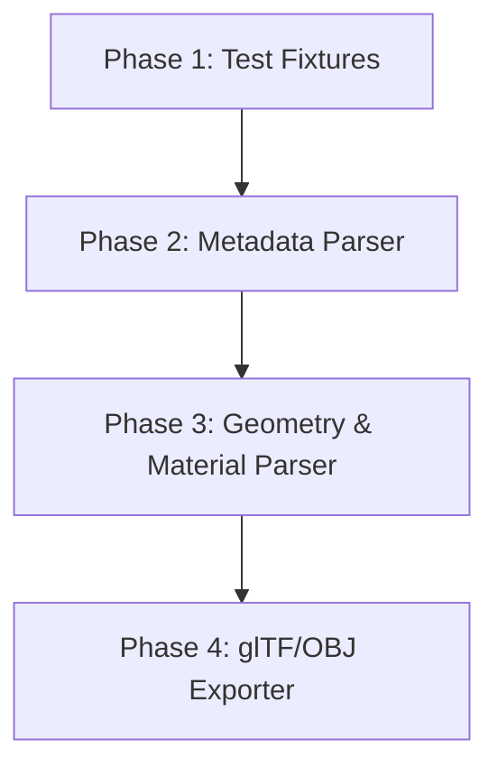

# OS-005-SPIKE-001 - Research OMSI O3D Format Structure

This document outlines the technical research on the proprietary `.o3d` 3D mesh binary format used by **OMSI / OMSI 2 (Omnibus Simulator)**. It gathers known facts, lists assumptions, highlights security and performance risks, and proposes a safe parser implementation strategy.

---

## 1. Role of `.o3d` in OMSI Assets

In OMSI, a scenery object is defined by a text-based `.sco` file. The `.sco` file acts as the configuration and behavior layer, referencing `.o3d` files for the actual 3D geometry:
*   **Mesh Reference**: Defined using the `[mesh]` tag in `.sco` or model `.cfg` files, pointing to a relative path (typically under a `Model` subdirectory).
*   **Decoupled Logic**: The `.o3d` file contains only geometry (vertices, normals, texture coordinates), embedded material metadata, bone/animation links, and texture references. It contains no collision physics, scripting, or game logic—those are kept in the `.sco` file.
*   **Drawcall Optimization**: The OMSI engine is optimized for DirectX drawcalls. Meshes are typically divided or grouped by materials/textures, where each `.o3d` file represents a submesh utilizing a single material or texture combination.

---

## 2. Confirmed Binary Layout Facts

Based on reverse-engineering documentation and open-source community implementations (e.g., `space928/Blender-O3D-IO-Public` and `Road-hog123/Blender-OMSI-Exporter`):

### General Details
*   **Endianness**: Little-endian (`<`).
*   **String Encoding**: String fields (such as texture filenames) are typically stored as length-prefixed ANSI/ASCII byte sequences.

### Header Layout
*   The header begins with a version indicator.
*   **Long Headers (Version >= 3)**: Start with a 4-byte unsigned integer (`<I`).
*   **Short/Legacy Headers (Version < 3)**: Start with a 2-byte unsigned short (`<H`).
*   The header exposes size metadata, including:
    *   Vertex count
    *   Triangle/face count
    *   Material count
    *   Bone and weight counts (if animated)

### Vertex Buffer Layout
Each vertex is represented by a fixed-size block of **32 bytes** (8 single-precision floats, format string `<ffffffff`):
1.  **Position**: `x`, `y`, `z` (3 floats / 12 bytes)
2.  **Vertex Normal**: `nx`, `ny`, `nz` (3 floats / 12 bytes)
3.  **UV Coordinates**: `u`, `v` (2 floats / 8 bytes)

### Triangle/Face Index Layout
Faces are stored as triangles referencing vertex indices:
*   **Standard Triangle Indices (Vertex Count <= 65,535)**:
    *   Unpacked format: `<HHHH` (8 bytes total).
    *   Contains 3 unsigned short indices for the vertices and 1 unsigned short index for the material slot.
*   **Long Triangle Indices (Vertex Count > 65,535)**:
    *   Unpacked format: `<IIIH` (14 bytes total).
    *   Contains 3 unsigned integer indices for the vertices and 1 unsigned short index for the material slot.

### Encryption
*   Some commercial add-on creators encrypt their `.o3d` files to protect intellectual property.
*   Decryption requires executing specific cryptographic transformations (e.g., those found in `o3d_crypto.py`). Encrypted files cannot be parsed by a standard geometry reader without the correct decryption key/wrapper.

---

## 3. Assumptions & Uncertainties

> [!NOTE]
> The following assumptions are marked with their respective confidence levels and must be validated during prototyping.

### Axis Orientation and Coordinate Systems
*   **Assumption**: OMSI uses `X` (right), `Y` (forward/depth), and `Z` (up). DirectX traditionally uses `Y`-up or `Z`-up left-handed systems. When reading `.o3d` data to convert to modern formats like glTF (which uses a right-handed `Y`-up system) or OBJ (right-handed `Z`-up), coordinate axis swapping and sign inversion will be required.
*   **Confidence**: High (supported by Blender exporter plugins swapping axes).

### Triangle Winding Order
*   **Assumption**: DirectX uses clockwise (CW) winding for front-facing triangles, whereas modern formats like OpenGL/glTF default to counter-clockwise (CCW) winding. If winding order is not flipped during conversion, models will appear inside-out (backface culling issues).
*   **Confidence**: High.

### Material Overrides
*   **Assumption**: If a texture path in `.o3d` is empty, or if the `.sco` file defines a `[matl]` texture swap, the engine overrides the `.o3d` material at runtime. The parser should expose embedded material names but allow the conversion pipeline to supply overrides.
*   **Confidence**: Medium.

---

## 4. Safety & Security Risks for Untrusted Binary Files

When parsing binary data, precautions must be taken to prevent application vulnerabilities:

1.  **Memory Allocation Denial of Service (DoS)**:
    *   *Risk*: A malicious `.o3d` file could declare a vertex count of `2,147,483,647` in its header. A naive parser allocating memory using `new Vertex[vertexCount]` would crash the application with an `OutOfMemoryException`.
    *   *Mitigation*: Implement a size validation check. Before allocating arrays, verify that the remaining stream size in bytes is at least `vertexCount * 32` bytes.
2.  **Out-of-Bounds Indexing / Buffer Overflow**:
    *   *Risk*: Corrupt index buffers could contain triangle indices referencing a vertex index larger than the vertex count (e.g., index `10,000` on a mesh with `50` vertices), causing an array index out of bounds exception when building the mesh.
    *   *Mitigation*: Validate every face index against the parsed vertex array boundaries. Throw a formatted `OmsiO3dParseException` if any index is invalid.
3.  **Malformed Length-Prefixed Strings**:
    *   *Risk*: A string length-prefix specifying a massive value could trigger excessive memory allocation or read past the file boundary.
    *   *Mitigation*: Bound-check string lengths against the remaining stream length before reading bytes.

---

## 5. Suggested Implementation Strategy

To implement `.o3d` support safely, we recommend a phased boundary strategy:

### Phase 1: Test Fixtures
Collect or synthesize a small set of open-license `.o3d` files:
*   A basic cube (single material, standard short header).
*   A multi-material mesh.
*   A large mesh (>65,535 vertices) using long triangle indices.
*   A corrupted/malformed model to assert security boundaries.

### Phase 2: Metadata Parser
Implement an lightweight `OmsiO3dMetadataReader` in C# that only parses the file headers (version, element counts, texture paths).
*   *Advantage*: Extremely fast, handles safety bounds checking, and validates if the file exists and is readable without loading heavy vertex structures into memory.

### Phase 3: Geometry & Material Parser
Extend to an `OmsiO3dParser` that reads all vertex/index buffers and maps them to a structured C# record model (e.g., `O3dMesh`).

### Phase 4: Integration with Conversion Service
Integrate the parser into the `AssetConversionService` to translate the parsed geometry into glTF or OBJ format, applying the necessary coordinate system transformations and winding flips.

---

## Implementation Note (June 2026)

Phase 1 (Test Fixtures), Phase 2 (Metadata Parser), and Phase 3 (Geometry & Material Parser) of the O3D roadmap have been fully completed under the **OS-006-FEATURE-001** and **OS-007-FEATURE-002** epics.
*   **Contract**: The service interfaces `IO3dMetadataReader` and `IO3dGeometryReader` in `OmsiStudio.Core` define the parsing contracts, implemented by concrete readers in `OmsiStudio.OmsiFormat` and verified via a comprehensive suite of unit and safety audit tests.
*   **Safety & Diagnostics**: Robust bounds checking prevents Denial of Service (DoS) memory allocation attacks, validates string boundaries, protects against truncated streams, validates index ranges (both vertex and material slots), and generates structured diagnostics. Cooperative cancellation is fully supported throughout geometry parsing.
*   **Scope Boundaries**: **Phase 4 (glTF/OBJ Exporter)** and 3D rendering/viewport remain unimplemented and are reserved for future spikes. No 3D visualization, rendering viewport, or exporter conversions exist in the codebase.

---

## 6. Cited Sources

1.  **Blender-O3D-IO-Public GitHub Repository**: [space928/Blender-O3D-IO-Public](https://github.com/space928/Blender-O3D-IO-Public) (Source for `o3dconvert.py` binary formats).
2.  **Blender-OMSI-Exporter GitHub Repository**: [Road-hog123/Blender-OMSI-Exporter](https://github.com/Road-hog123/Blender-OMSI-Exporter) (Reference Python exporter codebase).
3.  **OMSI WebDisk Community Forums**: [OMSI WebDisk](https://reboot.omsi-webdisk.de/) (Technical forum discussions regarding format limits and SDK tools).
